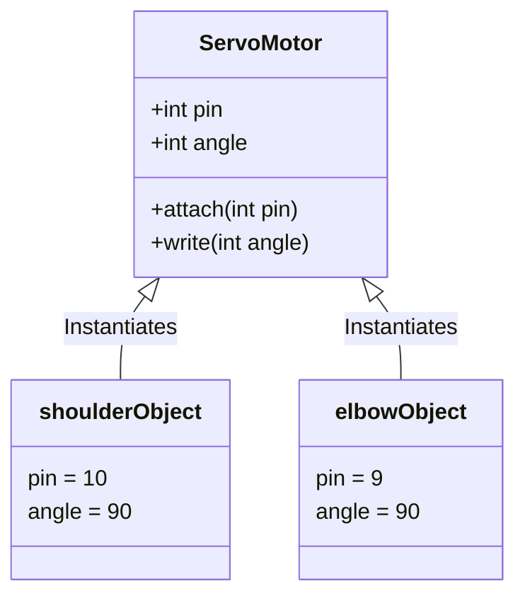

# Lesson 08: Classes & Objects

Object-Oriented Programming (OOP) is a programming paradigm that structures software around **objects** rather than functions or procedural logic. In robotics, OOP is a natural fit because a robot is physically made up of discrete, tangible components: motors, sensors, wheels, and grippers.

In C++, we model these physical components as **Classes**, and the individual components on the physical robot become **Objects**.

---

## Blueprints vs. Physical Things

* **Class (The Blueprint):** A user-defined data type that describes the attributes (data) and behaviors (functions) that all objects of this type will have. It does not occupy memory space until an object is created.
* **Object (The Instance):** A concrete instance of a class. It represents an actual component and occupies memory.



---

## Defining a Class in C++

A class is defined using the `class` keyword. Inside the class, we define members:
* **Member Variables (Attributes):** The data stored by the object.
* **Member Functions (Methods):** The actions the object can perform.

### Access Specifiers: `public` vs. `private`
In C++, access specifiers control who can read or write the class members:
* `public:` Members are accessible from outside the class (e.g. from the `main()` function).
* `private:` Members are only accessible from within the class's own member functions. By default, all class members in C++ are private.

Let's define a simple `ServoMotor` class.

```cpp
#include <iostream>

class ServoMotor {
public:
    // Public member variables (visible to everyone)
    int pin;
    int currentAngle;

    // Public member function (behavior)
    void rotateTo(int targetAngle) {
        currentAngle = targetAngle;
        std::cout << "Servo on pin " << pin << " rotated to " << currentAngle << " degrees." << std::endl;
    }
};

int main() {
    // Instantiate two objects of type ServoMotor
    ServoMotor baseServo;
    ServoMotor elbowServo;

    // Configure individual object attributes
    baseServo.pin = 11;
    baseServo.currentAngle = 90;

    elbowServo.pin = 9;
    elbowServo.currentAngle = 45;

    // Call member functions on specific objects
    baseServo.rotateTo(120);
    elbowServo.rotateTo(90);

    return 0;
}
```

---

## Connection to the BraccioV2 Library

In `BraccioV2.h`, the entire interface is built around the `Braccio` class:

```cpp
class Braccio {
  public:
    Braccio();
    void begin();
    bool setAllAbsolute(int b, int s, int e, int w, int w_r, int g);
    // ...
  private:
    void _softStart();
    Servo _base;
    Servo _shoulder;
    // ...
};
```
* **Public Interface:** Skew developers can call `begin()` or `setAllAbsolute()` in their main `sketch.ino` file because these functions are `public`.
* **Private Internals:** Developers *cannot* call `_softStart()` or access the internal `Servo _base;` objects directly. Doing so would cause a compilation error. This protects the hardware from accidental or incorrect usage.

---

## Practice Exercises

### Exercise 1: Model a LED Class
Create a class named `LED` with:
* A public member variable `int pin`.
* A public member variable `bool isOn`.
* A public method `void turnOn()` that sets `isOn` to `true` and prints `LED on pin [pin] is ON`.
* A public method `void turnOff()` that sets `isOn` to `false` and prints `LED on pin [pin] is OFF`.

Test it in `main()` by instantiating a status LED on pin 13, turning it on, and then off.

<details>
<summary><b>View Solution</b></summary>

```cpp
#include <iostream>

class LED {
public:
    int pin;
    bool isOn;

    void turnOn() {
        isOn = true;
        std::cout << "LED on pin " << pin << " is ON" << std::endl;
    }

    void turnOff() {
        isOn = false;
        std::cout << "LED on pin " << pin << " is OFF" << std::endl;
    }
};

int main() {
    LED statusLED;
    statusLED.pin = 13;
    statusLED.isOn = false;

    statusLED.turnOn();
    statusLED.turnOff();

    return 0;
}
```
</details>

### Exercise 2: Predict the Access Error
Why will the following code fail to compile? What is the access specifier of `maxAngle` by default?
```cpp
#include <iostream>

class SafetyJoint {
    int maxAngle = 180; // No access specifier listed
};

int main() {
    SafetyJoint joint;
    std::cout << joint.maxAngle << std::endl;
    return 0;
}
```

<details>
<summary><b>View Solution</b></summary>
The code fails to compile with an error stating that `maxAngle` is private.

In C++, any members declared inside a `class` before an access specifier is listed are **`private`** by default. Because `maxAngle` is private, the function `main()` (which is outside the class) is not allowed to read it directly.

**To fix this, add the `public:` specifier:**
```cpp
class SafetyJoint {
public:
    int maxAngle = 180;
};
```
</details>

---

[Previous: Lesson 07](../Part1_Cpp_Basics/lesson07_preprocessor.md) | [Next: Lesson 09](lesson09_constructors.md)
