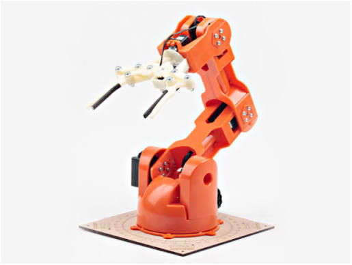

# BraccioV2 C++ Masterclass

Welcome to the **BraccioV2 C++ Masterclass**! This is a complete, hands-on learning curriculum designed to take you from a C++ beginner to building your own object-oriented robotic control library for the Arduino platform.

Embedded systems and robotics require code that is not only highly performant and memory-efficient but also modular and easy to maintain. By learning C++ in the context of the **Braccio V2 Robotic Arm**, you will bridge the gap between abstract computer science concepts and real-world physical hardware.

> This community edition is curated by **Tab Precious**, a core member of the **Hardware Innovation Valley Community (HWIVC)** in Buea, Cameroon. It is part of a wider community effort to promote practical robotics and embedded systems learning.
>
> **Author:** Tab Precious  
> **LinkedIn:** [Tabu Precious](https://cm.linkedin.com/in/tambu-precious-29bb67217)  
> **Community:** [HWIVC](https://hwivc.org/)

---

## Meet the Hardware

Here is the Braccio V2 Robotic Arm that you will be writing C++ code to control. It has six servo-controlled joints (base rotation, shoulder, elbow, wrist pitch, wrist rotation, and gripper) that require precise coordination, limit handling, and smooth speed curves.

---

## Course Blueprint

The masterclass is structured as a sequential journey that starts with basic language concepts and ends with deployable hardware libraries:

### 📘 [Part 1: C++ Basics & Compilation](Part1_Cpp_Basics/lesson01_compiler.md)
*Lessons 1–7:* Understading the compiler toolchain, C++ syntax, variable types, scopes, functions, separate compilation (headers vs. source files), include guards, and preprocessor macros.

### 📙 [Part 2: Object-Oriented Programming (OOP)](Part2_OOP/lesson08_classes.md)
*Lessons 8–11:* Modeling physical robot parts using classes and objects, writing constructors with member initialization lists, enforcing safety through encapsulation, and designing const-safe methods.

### 📗 [Part 3: Pointers, References & Memory](Part3_Memory/lesson12_pointers.md)
*Lessons 12–15:* Gaining a deep understanding of memory addresses, pointers, C++ references, the difference between Stack and Heap, and managing multi-joint states with memory-aligned arrays.

### 📕 [Part 4: Custom Arduino Library Design](Part4_Arduino_Libraries/lesson16_arduino_ecosystem.md)
*Lessons 16–20:* Exploring the Arduino IDE build process, dissecting the official BraccioV2 library code, and writing your own custom version of the library (`MyBraccio`) from scratch to import and run on hardware.

---

## How to Get the Most Out of This Course

1. **Read & Compile:** Every lesson contains minimal, compilable C++ code snippets. Do not just read them—type them out, compile them using `g++`, and run them to see the results.
2. **Build the Projects:** Complete the structural projects (such as simulating joint movements) to cement your understanding of how separate components interact.
3. **Attempt the Exercises:** At the end of each section, try the exercises in the [Practice Workbook](Exercises/exercises_solutions.md) without looking at the solutions first.
4. **Deploy to Hardware:** If you have an Arduino and a Braccio V2 arm, deploy the library we build in Part 4 and watch your custom C++ code control a physical robot!

---

[Next: Course Roadmap](roadmap.md)
