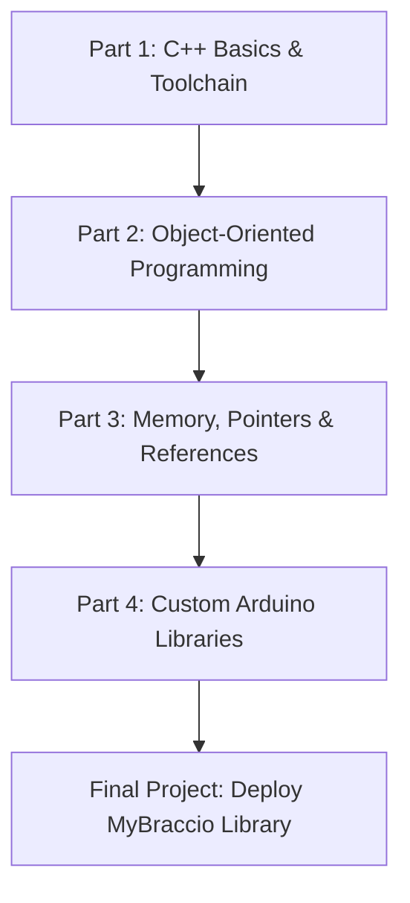

# Course Roadmap

The **BraccioV2 C++ Masterclass** is designed to take you on a structured progression from C++ fundamentals to advanced library design. This roadmap details your learning path and milestones.

---

## The Learning Journey

---

## Suggested Progression

### Milestone 1: C++ Basics & Compilation (Lessons 1-7)
Learn how code is turned into machine instructions. You'll master variables, decision statements, functions, include guards, and the C++ preprocessor.
* **Goal:** Create, compile, and run multi-file C++ command-line applications.

### Milestone 2: Object-Oriented Programming (Lessons 8-11)
Shift your mindset from procedural code to object-oriented design. Model physical joints as classes, manage their state safely, and use constructors to initialize hardware configurations.
* **Goal:** Model a robot joint with strict bounds checking and public/private encapsulation.

### Milestone 3: Memory, Pointers, and References (Lessons 12-15)
Demystify how C++ uses memory. Understand how pointers point to addresses, how references act as aliases, and how arrays pack data sequentially.
* **Goal:** Write high-performance code that passes large objects by reference without copying, and manage joint states using arrays.

### Milestone 4: Arduino Library Integration (Lessons 16-20)
Bring your C++ knowledge to the Arduino environment. Learn how the Arduino IDE structures libraries, dissect the soft-start and non-blocking update routines of the BraccioV2 library, and code your own custom `MyBraccio` library.
* **Goal:** Build, document, and deploy a custom Arduino library that drives a physical robotic arm or simulation sketch.

---

## Detailed Lesson Breakdown

| Part | Lessons | Core Concepts | Hands-On Project |
| :--- | :--- | :--- | :--- |
| **Part 1** | Lessons 01–07 | Toolchain, Types, Control Flow, Functions, Headers, Include Guards, Macros | Separating declarations and definitions across multiple files |
| **Part 2** | Lessons 08–11 | Classes, Objects, Access Specifiers, Constructors, Encapsulation, Const Methods | Modeling a physical joint class with angle limit validation |
| **Part 3** | Lessons 12–15 | Pointers, Dereferencing, References, Pass-by-Reference, Stack vs Heap, Arrays | Creating an array of Joint objects and manipulating them via references |
| **Part 4** | Lessons 16–20 | Arduino ecosystem, official library code analysis, custom library coding, example sketches | Creating and importing the `MyBraccio` library to control 6 servos |

---

[Previous: Home](index.md) | [Next: Introduction](introduction.md)
